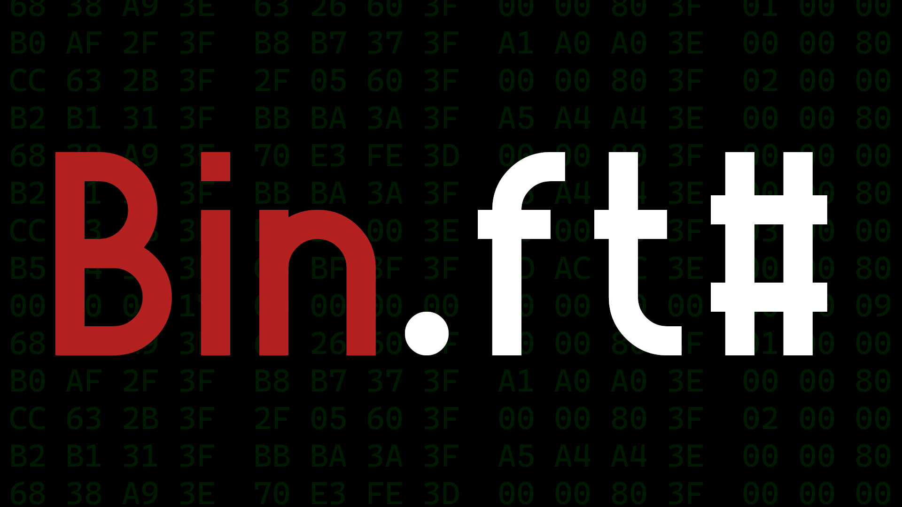

# Binft - Binary File Tools

Binft was created to assist with reading and writing data to filestreams when working with binary files for reverse engineering and researching file formats. This library provides a very high level api to make repetitive coding patterns in reading and writing data significantly shorter. 

There are three main classes involved in the function of the API. 

## Binft

The Binft class provides static methods for creating and opening filestreams wrapped in Binf objects which can then be accessed through the public methods belonging to the Binf object.

```csharp
//CREATE NEW FILE AT FILEPATH WITH BINF OBJECT FOR ACCESS
public static void Main(string[] args){
    bool isLittleEndian = true;
    if(!File.Exists(args[0])) return;
    string filePath = args[0];
    Binf binf = Binft.CreateBinf(filePath, isLittleEndian);
}


//OPEN EXISTING FILE FROM FILEPATH WITH BINF OBJECT FOR ACCESS
public static void Main(string[] args){
    bool isLittleEndian = false;
    string filePath = args[0];
    Binf binf = Binft.OpenBinf(filePath, isLittleEndian);
}
```

## DataRead

The DataRead class is not visible to the end user. It provides a variable endian implementation of the BitConverter class. The endianness of the binary file is specified in the OpenBinf or CreateBinf methods belonging to Binft. These methods access the Binf constructor which sets the endiannes of the file. The endianness boolean is passed to all of the DataRead methods so after the create or open method, no attention needs to be given to the endianness when processing data. 

When writing data, the following data types can be provided to the Write method:

```csharp
int
uint
short
ushort
long
ulong
string
fixedstring //custom type with a fixed length
byte
double
float
int[]
short[]
long[]
float[]
double[]
byte[]
```

## FixedString

The fixedstring is a custom struct designed to deal with files which have a set capacity for strings such as in a name table. When defining a fixedstring, the size of the string must be given along with the text. The fixed string exposes two methods to the user, the GetBytes method provides the byte representation of the string while the ToString override gives the string representation. The length can be set dynamically using the Length property and will resize the byte array for the byte representation. The text can be set dynamically using the Text property but can only be gotten with the ToString override which is used implicitly if the fixedstring is passed when a string is expected.

Example:

```csharp
//READ FIXED STRINGS FROM FILE
int stringLength = 0x20;
for(int i = 0; i < stringCount; i++){
    fixedstring fString = binf.ReadString(stringLength);
}

//CREATE FIXED STRING, EDIT PROPERTIES, PRINT, AND WRITE TO FILE
fixedstring fString = new fixedstring("Hello World", 0x18);
fString.Length = 0x20;
fString.Text = "I Changed My Mind";
Console.WriteLine(fString);
byte[] bytes = fString.GetBytes();
binf.Write(fString);
```

## Binf

The Binf class is the general purpose binary file class. Its constructor is not exposed so the object must be created through the Binft methods described above. The Binf instance methods are exposed and can be used to shorten common coding patterns associated with reading and writing data to a binary file. When a Binf is instantiated, a FileStream is created and associated with the Binf object. The FileStream is not directly exposed but the following methods allow for manipulation of the stream:

#### Methods

| Method                     | Description                                                                                                                               |
| -------------------------- | ----------------------------------------------------------------------------------------------------------------------------------------- |
| Close()                    | Closes the binary file stream.                                                                                                            |
| GoTo(int)                  | Seeks to a position in the binary stream from the start of the file.                                                                      |
| GoTo(long)                 | Seeks to a position in the binary stream from the start of the file.                                                                      |
| ReadByte()                 | Reads the next byte from the file, advancing the stream by 1 byte.                                                                        |
| ReadBytes(int)             | Reads a byte array from the file, advancing the stream by the specified length.                                                           |
| ReadDouble()               | Reads a double from the file, advancing the stream by 8 bytes.                                                                            |
| ReadFloat()                | Reads a float from the file, advancing the stream by 4 bytes.                                                                             |
| ReadFloatArray(int)        | Reads a float array from the file, advancing the stream by the specified count multiplied by 4.                                           |
| ReadInt()                  | Reads an integer from the file, advancing the stream by 4 bytes.                                                                          |
| ReadIntArray(int)          | Reads an int array from the file, advancing the stream by the specified count multiplied by 4.                                            |
| ReadLong()                 | Reads a long from the file, advancing the stream by 8 bytes.                                                                              |
| ReadShort()                | Reads a short from the file, advancing the stream by 2 bytes.                                                                             |
| ReadString()               | Reads a null-terminated string from the file. The number of bytes advanced through the stream matches the length of the string found.     |
| ReadString(char)           | Reads a char-terminated string from the file. The number of bytes advanced through the stream matches the length of the string found.     |
| ReadString(int)            | Reads a null-terminated string from the file. The number of bytes advanced through the stream is set by the length parameter.             |
| ReadString(int, char)      | Reads a null-terminated string from the file. The number of bytes advanced through the stream is set by the length parameter.             |
| ReadUInt()                 | Reads an unsigned integer from the file, advancing the stream by 4 bytes.                                                                 |
| ReadULong()                | Reads an unsigned long from the file, advancing the stream by 8 bytes.                                                                    |
| ReadUShort()               | Reads an unsigned short from the file, advancing the stream by 2 bytes.                                                                   |
| Skip(int)                  | Seeks to a position in the binary stream from the current position in the file.                                                           |
| Write<T>(T)                | Writes the byte representation of data to the binary file.                                                                                |
| WriteToPosition<T>(T, int) | Writes the byte representation of data to the binary file at a specified position and then returns to the current position in the stream. |

#### Properties

The Binf class only contains one property, Position, which can be used to get the current position of the stream in the file.

## Examples

For a comprehensive archive extraction example, the DIP Tools extraction class has been updated to use the binft package. 

[DIP Tools Extractor.cs](https://github.com/xMcacutt/Yukes-DIP-Tools/blob/master/DIP%20Extractor/Extractor.cs)

## Future Plans

The goal with binf is to begin implementing common file format structures to aid in their reversal. The primary format goals are

- Archives

- Images

- 3D Models

- Audio

- Video

These will come as separate packages but will also all be pulled into the main binft nuget. For example, binft.arch (binary file tools - acrhive).

## Author

This package was created by Matthew Cacutt. 

You can find me on [Github](https://github.com/xMcacutt/) or join my [Discord](https://discord.gg/qkPHxEEczd "https://discord.gg/qkPHxEEczd").
